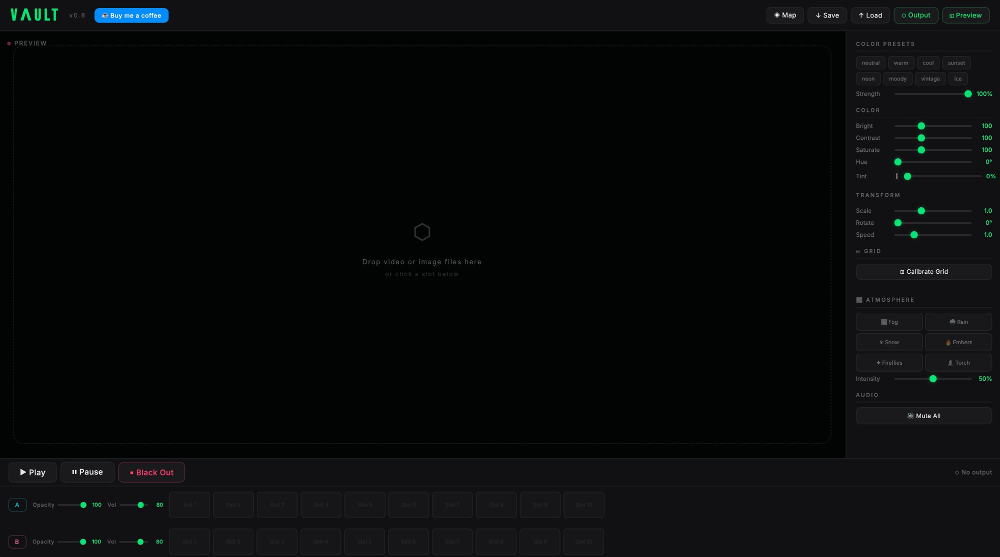

# VΛULT — Free Browser-Based Projection Mapping

**[🔗 Launch VAULT](https://vaultmapping.netlify.app/)**

VAULT is a free, browser-based projection mapping tool built for tabletop RPG players, VJs, and anyone who wants to warp video or images onto surfaces using a projector. No downloads, no installs, no accounts. Just open and go.

## Features

- **Projection mapping** — Drag corner pins to warp your image/video onto any surface. Add extra control points for irregular shapes.
- **Video + Image support** — Load battle maps, animated scenes, static images, or video loops
- **Two layers** — Blend content (e.g., a map on Layer A + weather effects on Layer B)
- **Color presets** — Warm, Cool, Moody, Neon, Sunset, Vintage, Ice — with adjustable strength
- **FX** — Vignette, glow, film grain, soft blur, dreamy, mirror, sepia, letterbox
- **Seamless video looping** — Double-buffer system eliminates black frames between loops
- **Output window** — Pop out a separate window for your projector, keep controls on your main screen
- **Preview window** — Clean native-resolution feed for a TV or monitor
- **Save/Load projects** — Save your mapping, colors, and settings between sessions
- **Webcam input** — Use a live camera feed as a source
- **100% client-side** — No data ever leaves your browser. All processing happens locally.

## How to Use

### Quick Start
1. Open [vaultmapping.netlify.app](https://vaultmapping.netlify.app/) (or open `index.html` locally)
2. Click a slot in Layer A and load an image or video
3. Click **⬡ Output** and drag the window to your projector
4. Click **◈ Map** and drag the corners to fit your surface
5. Hit **✓ Save & Close** — done!

### Self-Hosting
VAULT is a single HTML file with zero dependencies. To run it locally:

1. Download or clone this repo
2. Open `index.html` in any modern browser (Chrome, Firefox, Edge, Safari)
3. That's it. No server, no build step, no npm install.

### For D&D / Tabletop RPGs
- Set your projector as an **extended display** (not mirrored)
- Load your battle maps into the 6 slots before your session
- Use Layer B for ambient effects (fog, fire, weather) blended over your map
- Use color presets to set mood — "Moody" for dungeons, "Warm" for taverns
- **Save your project** so mapping persists between sessions

## Tech

- Pure HTML/CSS/JavaScript — no frameworks, no dependencies
- Canvas 2D rendering with real-time compositing
- Double-buffer video system for seamless looping
- Fan triangulation from centroid for multi-point mesh warping
- All processing client-side — works offline after first load

## License

MIT License — free to use, modify, and distribute.

## Support

If you find VAULT useful, you can [buy me a coffee ☕](https://venmo.com/shane-burke)

Built with ❤️ for the D&D and projection mapping community.
